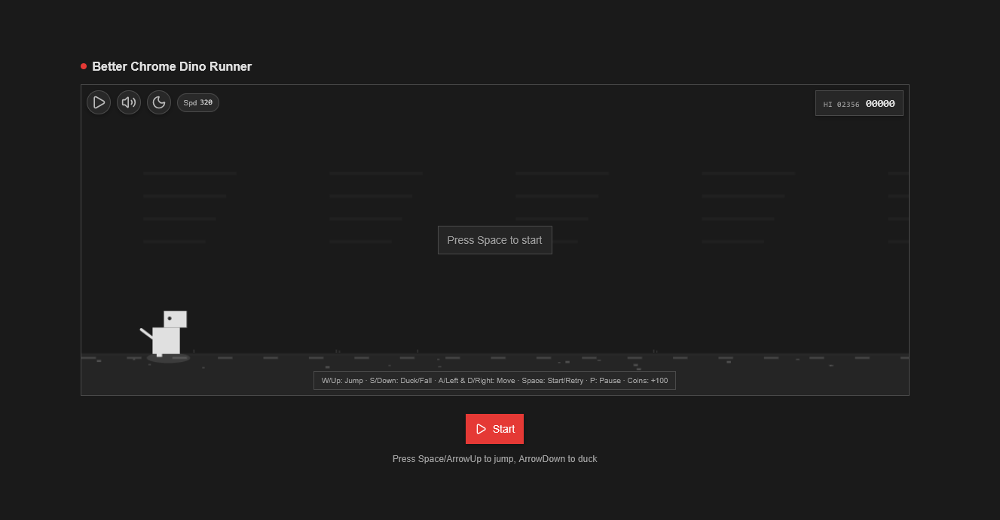

# Better Chrome Dino Runner

An enhanced, minimalist, theme-aware Dino Runner built with React + TypeScript + Vite and TailwindCSS (shadcn tokens).

## Features

- Smooth 60fps game loop with physics (coyote time, jump buffer, jump-cut, fast-fall)
- Horizontal movement (A/D or Left/Right)
- Obstacles scale with score; birds fly lower over time (ducking matters)
- Collectibles (coins) with score effect (+100 each)
- Theme toggle (light/dark), pause (P), start/retry (Space)
- Responsive canvas and clean UI/HUD with shadcn tokens

## Controls

- W / Up: Jump
- S / Down: Duck (ground) / Fast-fall (air)
- A / Left and D / Right: Move horizontally
- Space: Start / Retry
- P: Pause

## Scripts

- `pnpm dev` – start dev server
- `pnpm build` – type-check and build
- `pnpm preview` – preview production build
- `pnpm lint` – run ESLint

## Tech Stack

- React 19, TypeScript, Vite + SWC
- TailwindCSS v4 with shadcn/ui tokens

## License

MIT – see `LICENSE` file.
